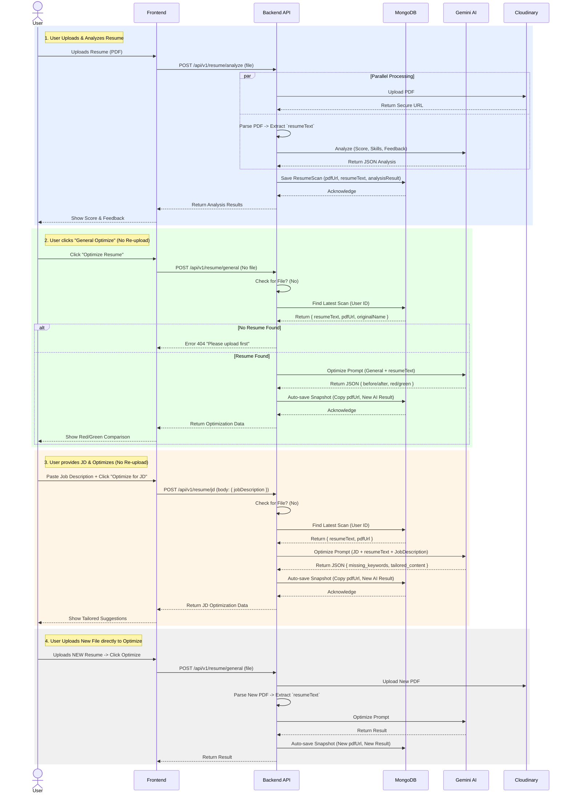

# Resume Optimization Flow Sequence Diagram

This diagram illustrates the workflow for Resume Analysis and subsequent Optimization (General & JD-Specific), highlighting how the system handles cases with and without re-uploading the file.

