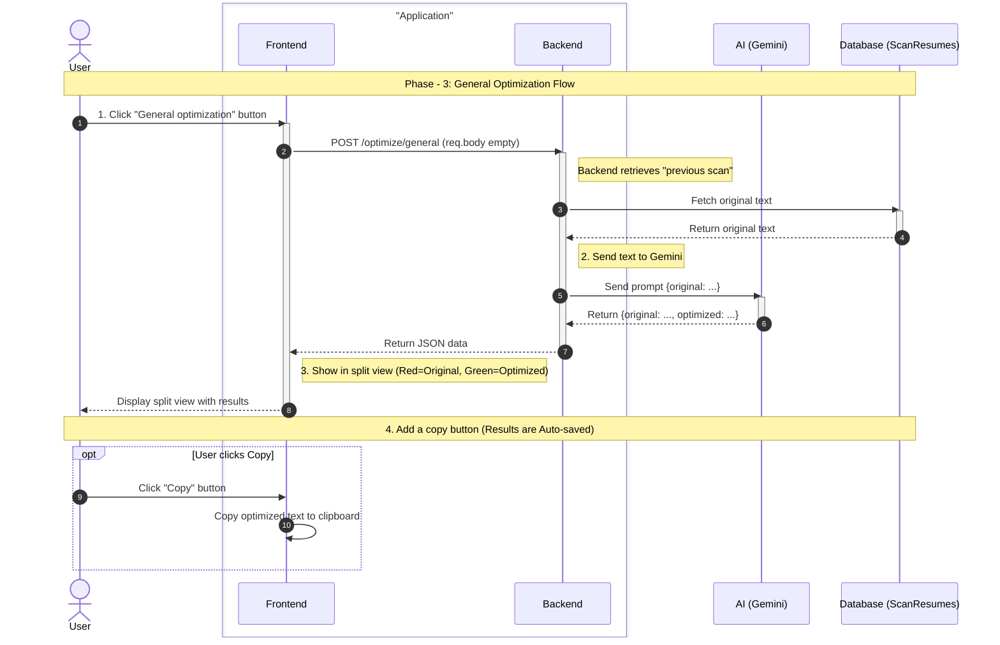
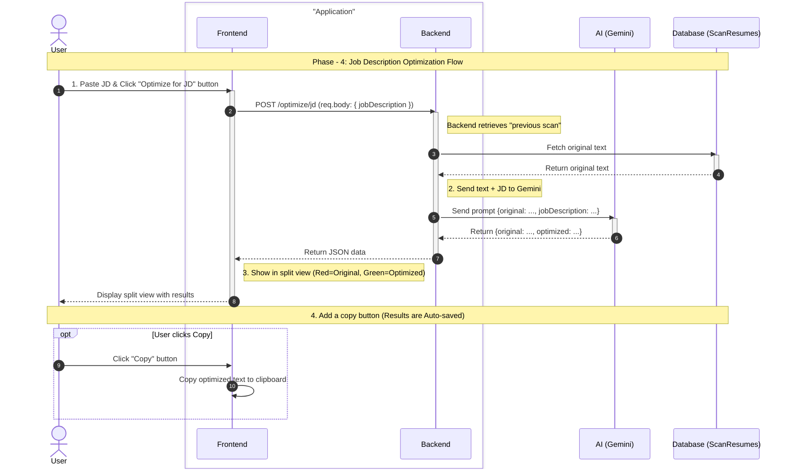

# Frontend Optimization Flows

## Phase - 3: General Optimization Flow

```mermaid
sequenceDiagram
    autonumber
    actor User
    box "Application"
    participant Frontend
    participant Backend
    end
    participant AI as AI (Gemini)
    participant Database as Database (ScanResumes)

    note over User, Database: Phase - 3: General Optimization Flow

    User->>Frontend: 1. Click "General optimization" button
    activate Frontend

    Frontend->>Backend: POST /optimize/general (req.body empty)
    activate Backend

    note right of Backend: Backend retrieves "previous scan"
    Backend->>Database: Fetch original text
    activate Database
    Database-->>Backend: Return original text
    deactivate Database

    note right of Backend: 2. Send text to Gemini
    Backend->>AI: Send prompt {original: ...}
    activate AI
    AI-->>Backend: Return {original: ..., optimized: ...}
    deactivate AI

    Backend-->>Frontend: Return JSON data
    deactivate Backend

    note right of Frontend: 3. Show in split view (Red=Original, Green=Optimized)
    Frontend-->>User: Display split view with results
    deactivate Frontend

    note over User, Database: 4. Add a copy button (Results are Auto-saved)

    opt User clicks Copy
        User->>Frontend: Click "Copy" button
        Frontend->>Frontend: Copy optimized text to clipboard
    end
```

## Phase - 4: Job Description Optimization Flow

```mermaid
sequenceDiagram
    autonumber
    actor User
    box "Application"
    participant Frontend
    participant Backend
    end
    participant AI as AI (Gemini)
    participant Database as Database (ScanResumes)

    note over User, Database: Phase - 4: Job Description Optimization Flow

    User->>Frontend: 1. Paste JD & Click "Optimize for JD" button
    activate Frontend

    Frontend->>Backend: POST /optimize/jd (req.body: { jobDescription })
    activate Backend

    note right of Backend: Backend retrieves "previous scan"
    Backend->>Database: Fetch original text
    activate Database
    Database-->>Backend: Return original text
    deactivate Database

    note right of Backend: 2. Send text + JD to Gemini
    Backend->>AI: Send prompt {original: ..., jobDescription: ...}
    activate AI
    AI-->>Backend: Return {original: ..., optimized: ...}
    deactivate AI

    Backend-->>Frontend: Return JSON data
    deactivate Backend

    note right of Frontend: 3. Show in split view (Red=Original, Green=Optimized)
    Frontend-->>User: Display split view with results
    deactivate Frontend

    note over User, Database: 4. Add a copy button (Results are Auto-saved)

    opt User clicks Copy
        User->>Frontend: Click "Copy" button
        Frontend->>Frontend: Copy optimized text to clipboard
    end
```
